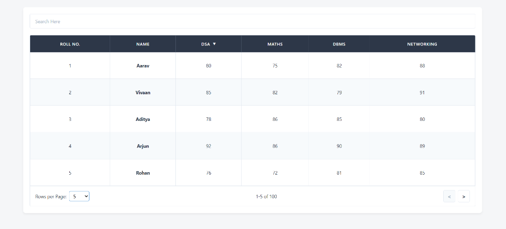
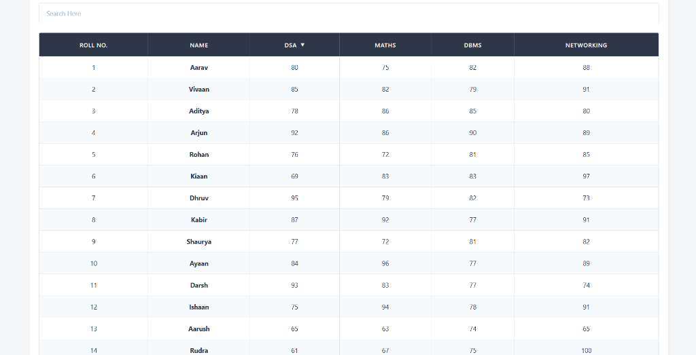
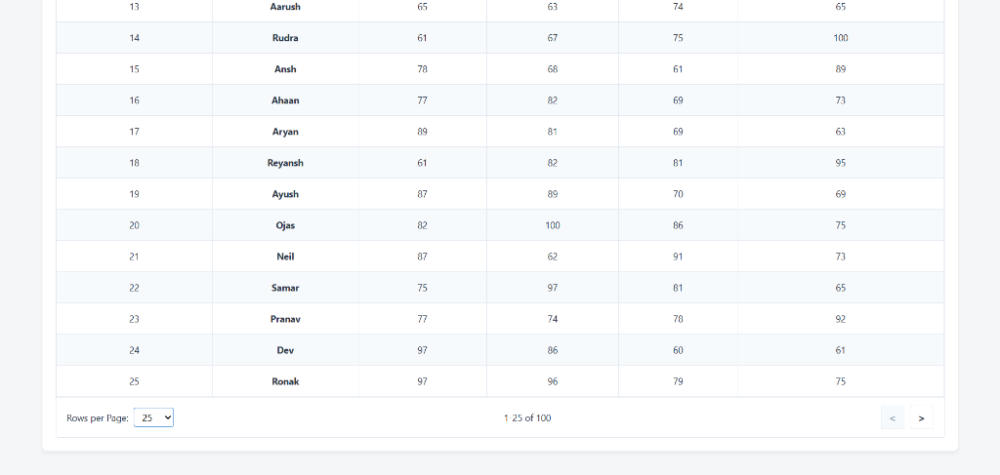
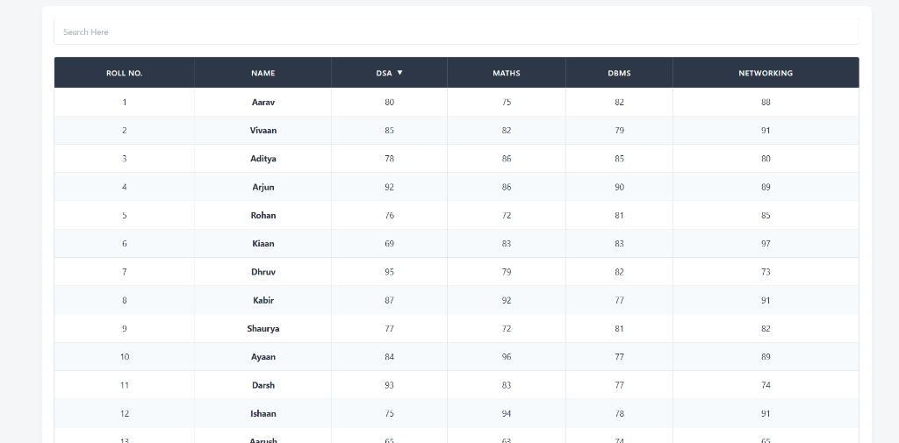
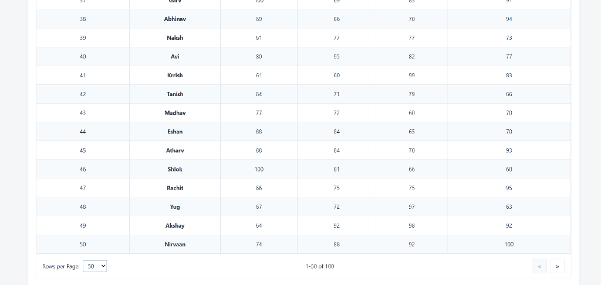
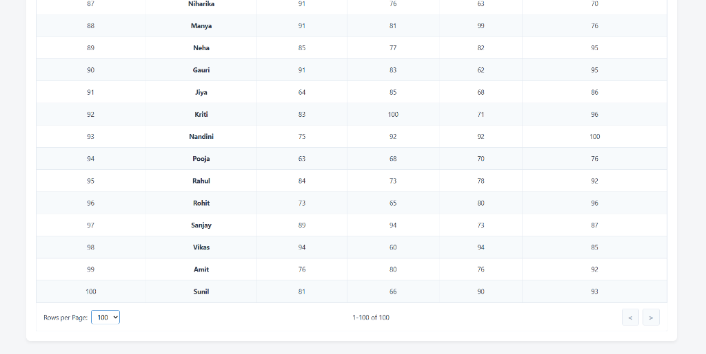
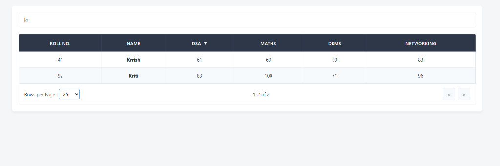
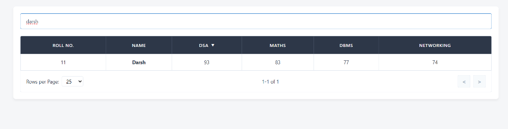

# 📊 Data Table


A fully responsive, feature-rich Data Table built with React, Vite, and JSON Server. It includes a beautiful UI, global search filtering, and dynamic pagination with adjustable rows per page.

## 🚀 Features

- **Global Search**: Instantly filter across all columns (Roll No, Name, Marks) by typing any text.
- **Dynamic Pagination**: Select between 5, 25, 50, or 100 rows per page.
- **Smart Layout**: 
  - **5 Rows**: Fixed 80vh height container with perfectly stretched rows to remove empty space.
  - **25+ Rows**: Auto-expanding container height so all rows are visible without internal scrolling.
- **Sticky Headers**: Table headers stay in place while scrolling.
- **Custom Pagination Controls**: Interactive and properly sized Next/Previous buttons.

## 📸 Output Screenshots

### 5 Rows View


### 25 Rows View
**Top:**


**Bottom (Showing Pagination):**


### 50 Rows View
**Top:**


**Bottom (Showing Pagination):**


### 100 Rows View
**Top:**


**Bottom (Showing Pagination):**


### Global Search Functionality
**Searching for "kr":**


**Searching for "darsh":**


## 🎥 Video Demonstration

[https://drive.google.com/file/d/1OYUB59ohHL8tatig2CReEZ00eGinugbV/view?usp=sharing]

## 📂 Project Structure

```text
data_table/
├── assets/                  # Project screenshots
├── public/                  # Static assets
├── src/
│   ├── App.css              # Main styles for layout and table
│   ├── App.jsx              # Main React component (Logic & UI)
│   ├── index.css            # Global styles (reset)
│   └── main.jsx             # React entry point
├── db.json                  # Mock database with 100 student records
├── package.json             # Dependencies and npm scripts
├── vite.config.js           # Vite configuration
└── README.md                # Project documentation
```

## 🛠️ Installation & Setup

1. **Install dependencies:**
   ```bash
   npm install
   ```

2. **Run the Application:**
   ```bash
   npm start
   ```
   *(This starts both the Vite dev server and the JSON server concurrently)*

3. **Open in Browser:**
   Navigate to `http://localhost:5173`

---

<div align="center">
  <h2>👨‍💻 Developed by <b>Krish Virpariya</b></h2>
 
  <i>Built with ❤️ using React & Vite</i>
</div>
"# data-table-project" 
